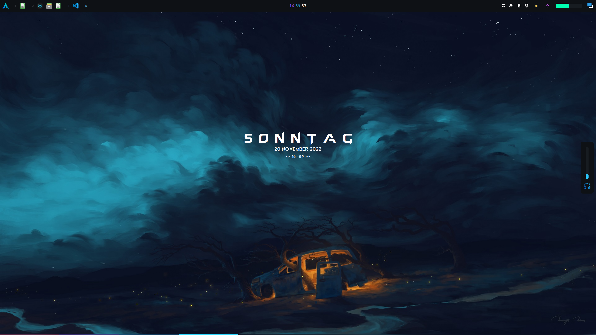
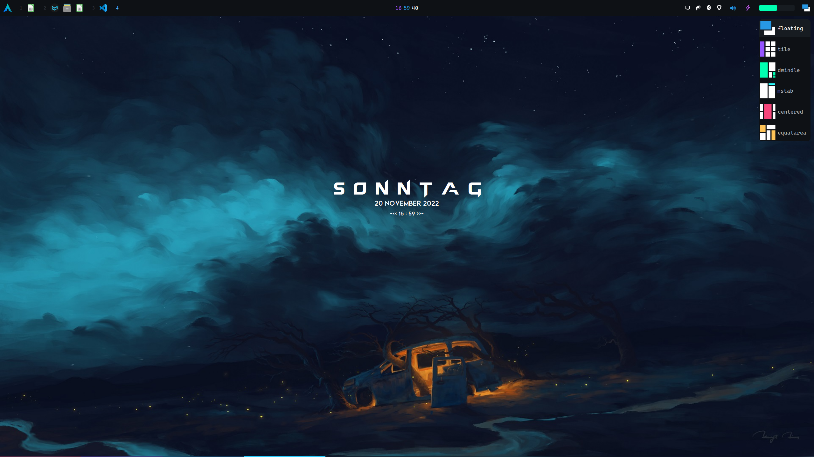
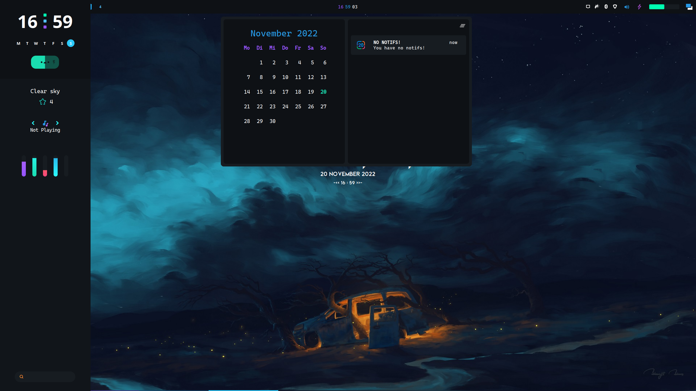
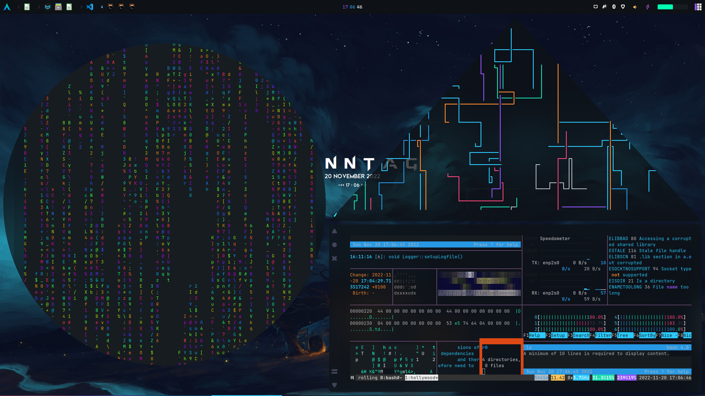
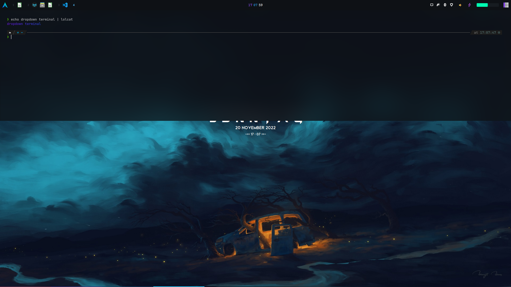

# AwesomeAetherized

**AwesomeAetherized is a awesomewm configuration based on the [linux rice by elenapan](https://github.com/elenapan/dotfiles).**

The goal of this project is to turn AwesomeWM into a feature-rich linux desktop while also remaining low in the memory consumption. The desktop is still heavily in development, so beware of bugs. I will be providing a list of features which still are or are going to be in development. User requests are more than welcome, so feel free to open an issue.

This repo only contains my awesomewm setup, you find my [dotfiles here](https://github.com/ahujaankush/AwesomeDots)

## Setup

These are the dependecies, which you need to install to use this AwesomeWM setup:

```shell
awesome-git rofi lm_sensors acpid jq fortune-mod redshift mpd mpc maim light-git inotify-tools xdotool xclip playerctl acpi
```

## Gallery









## Features

- dropdown terminal

- shaped windows

- control center

- battery bar 

- custom notifications

- different layouts

- bling (module)

- sidebar with run prompt

## Features in development

- Aetherized Toolbox
  
  - built-in wallpaper app
  
  - intern updater
  
  - snapshots of current settings
  
  - intern settings software

- save notifications

- markdown file preview as awesomewm widget